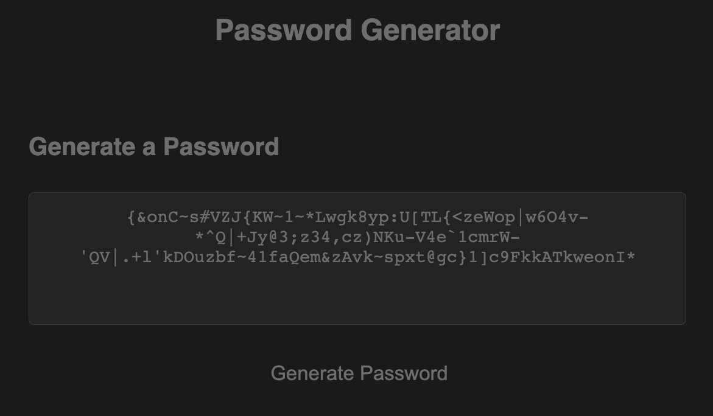

# parker-brook-password-generator-challenge03
Repo for Challenge 03 - Password Generator

## Description
This project is a random password generator. The program uses JavaScript to prompt the user to specify a password length (8-128 characters) and which types of characters they would like their password to comprise (numbers, special characters, uppercase letters, and lowercase letters).

There are alerts that will notify the user if password requirements are not met. These alerts include a warning message if the user requests password length shorter than 8 characters or longer than 128 and if the user enters a non-numeric character for the length as well. Additionally, an alert will be created if the user fails to select at least one type of character for the password's generation.

Link to deployed webpage: https://pbodybrooks.github.io/parker-brook-password-generator-challenge03/

## Screenshot

## Installation
N/A

## Credits
Anie Harmon provided me the arrays for the four character types (numbers, special characters, upper & lowercase letters) so that I did not have to manually type each one, quotation enclosed and comma separated.

## License
Please refer to repo.

## Features
This project features the use of JavaScript heavily and incorporates functions, methods, arrays, for loops and if statements, as well as random number generation, objects & properties. It also utilizes an event listener and query selectors.